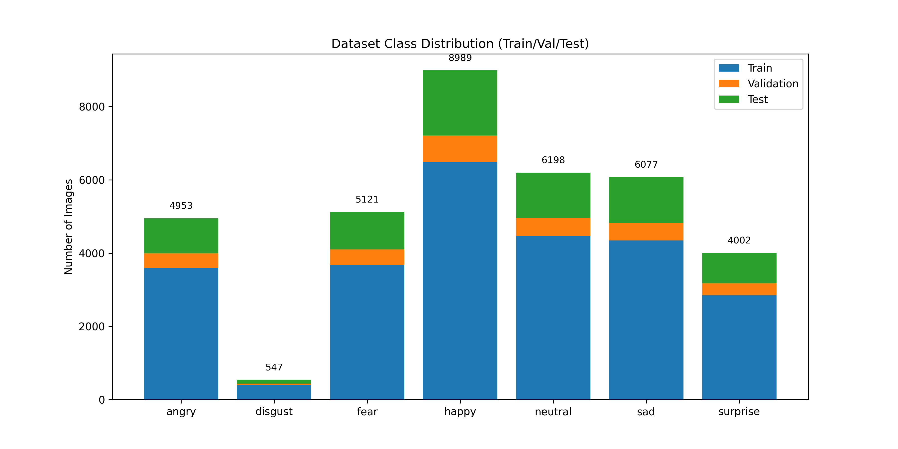
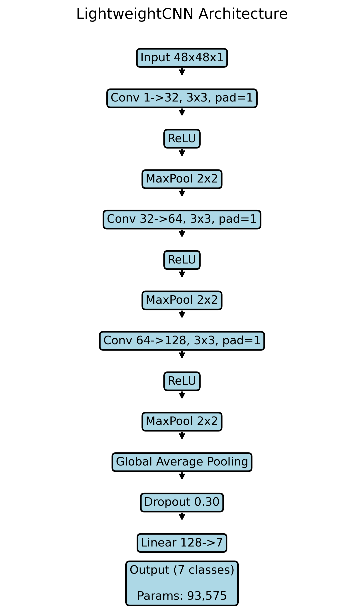
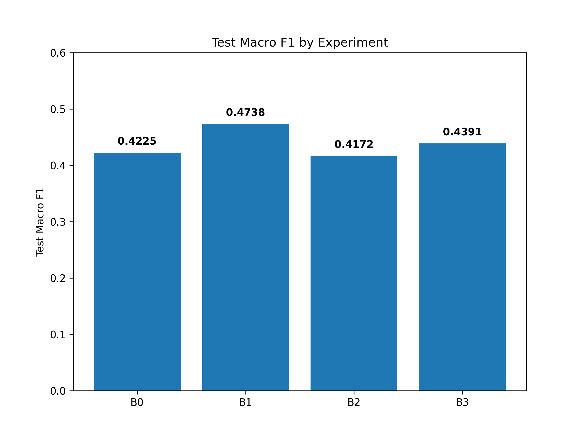
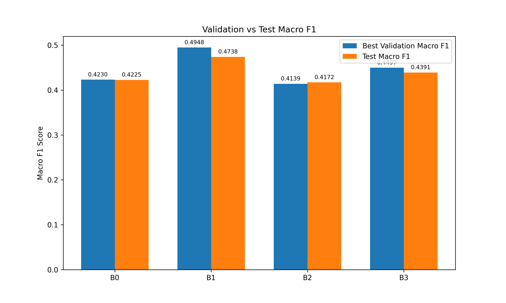
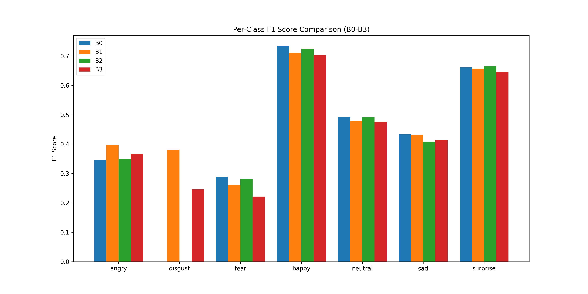
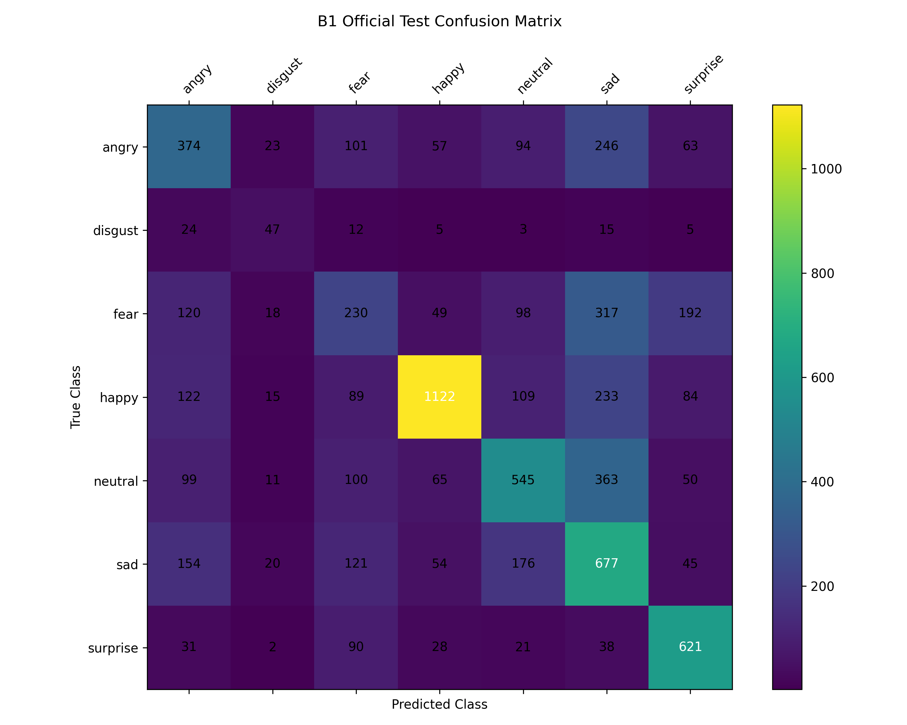

# Final Project Report

## 1. Experimental Design
Four controlled CNN experiments were conducted for 7-class Facial Expression Recognition:
- **B0 baseline**: Standard CrossEntropyLoss, no training augmentation.
- **B1 class weighting**: Weighted CrossEntropyLoss, no training augmentation.
- **B2 augmentation**: Standard CrossEntropyLoss, training augmentation.
- **B3 class weighting + augmentation**: Weighted CrossEntropyLoss, training augmentation.

All four experiments use the same LightweightCNN architecture and controlled training setup, with only the specified intervention changed.

## 2. Dataset
The dataset utilizes a fixed split to ensure strict experimental control.

*Figure 1: Class distribution across train, validation, and test sets. This highlights the severe class imbalance, particularly for the 'disgust' class.*

## 3. CNN Architecture
The 93,575-parameter lightweight architecture was held constant across all experiments.

*Figure 2: Flow diagram of the LightweightCNN architecture showing the sequential convolutional blocks, pooling, and dropout layers.*

## 4. Overall Results
| Experiment | Best Val Macro F1 | Test Accuracy | Test Macro Precision | Test Macro Recall | Test Macro F1 | Best Epoch | Training Time (s) |
|------------|-------------------|---------------|----------------------|-------------------|---------------|------------|-------------------|
| B0 | 0.4230 | 0.5116 | 0.4249 | 0.4294 | 0.4225 | 25 | 1871.88 |
| B1 | 0.4948 | 0.5038 | 0.4769 | 0.4862 | 0.4738 | 29 | 1843.98 |
| B2 | 0.4139 | 0.5104 | 0.4205 | 0.4205 | 0.4172 | 29 | 2080.40 |
| B3 | 0.4497 | 0.4967 | 0.4376 | 0.4493 | 0.4391 | 29 | 1931.98 |

*Figure 3: Test Macro F1 across B0-B3. The B1 configuration with class weights achieved the highest held-out test Macro F1.*

## 5. Validation vs Test

*Figure 4: Comparison of Best Validation Macro F1 vs Test Macro F1 across experiments. This illustrates the relationship between the metric used for model selection (Validation F1) and the final evaluation metric (Test F1).*

## 6. Effect of Class Weighting
Comparing B1 vs B0, test Macro F1 increased from 0.4225 to 0.4738. Test accuracy changed from 0.5116 to 0.5038. For the disgust class, F1 changed from 0.0000 to 0.3806.

## 7. Effect of Augmentation
Comparing B2 vs B0 under the tested augmentation (horizontal flip p=0.5, rotation [-10°, +10°]), test Macro F1 changed from 0.4225 to 0.4172.

## 8. Combined Intervention
Comparing B3 relative to the other configurations, the B3 Test Macro F1 was 0.4391. This was higher than B0 (0.4225) and B2 (0.4172), but lower than B1 (0.4738).

## 9. Per-Class Results & Error Analysis
| Class | B0 | B1 | B2 | B3 | B1 vs B0 | B2 vs B0 | B3 vs B0 |
|-----|--|--|--|--|--------|--------|--------|
| angry | 0.3475 | 0.3974 | 0.3492 | 0.3667 | +0.0499 | +0.0016 | +0.0191 |
| disgust | 0.0000 | 0.3806 | 0.0000 | 0.2458 | +0.3806 | +0.0000 | +0.2458 |
| fear | 0.2892 | 0.2603 | 0.2817 | 0.2214 | -0.0288 | -0.0075 | -0.0678 |
| happy | 0.7337 | 0.7115 | 0.7248 | 0.7032 | -0.0223 | -0.0090 | -0.0306 |
| neutral | 0.4932 | 0.4783 | 0.4916 | 0.4763 | -0.0149 | -0.0015 | -0.0168 |
| sad | 0.4330 | 0.4318 | 0.4079 | 0.4141 | -0.0013 | -0.0252 | -0.0189 |
| surprise | 0.6611 | 0.6568 | 0.6650 | 0.6461 | -0.0043 | +0.0039 | -0.0150 |

*Figure 5: Per-class F1 score comparison across B0-B3. This visually demonstrates the activation of the 'disgust' class when class weighting is applied (B1 and B3).*

The following recurring confusion transitions were recorded across B0-B3:

| Transition | B0 | B1 | B2 | B3 |
|------------|----|----|----|----|
| **fear -> sad** | 278 | 317 | 255 | 263 |
| **neutral -> sad** | 273 | 363 | 222 | 253 |
| **sad -> neutral** | 233 | 176 | 283 | 236 |
| **angry -> sad** | 254 | 246 | 202 | 190 |

## 10. Selected Model
Based on the highest observed Validation Macro F1 among B0-B3, B1 (class-weighted) is the selected candidate.

- Checkpoint path: `experiments/B1_class_weighted/checkpoint/best_model.pth`
- Best Validation Macro F1: 0.4948

### Held-Out Test Metrics
- Test Accuracy: 0.5038
- Test Macro Precision: 0.4769
- Test Macro Recall: 0.4862
- Test Macro F1: 0.4738

This configuration had the highest observed Validation Macro F1 among the four tested configurations. The test set was used only for final held-out evaluation and was not used to select the model configuration.

*Figure 6: Confusion matrix for the selected B1 model on the official test set. The majority of off-diagonal errors are concentrated in confusions with the 'sad' class.*

## 11. Limitations
- 93,575-parameter lightweight model
- severe class imbalance
- one augmentation configuration
- CPU-only training
- limited experimental scope
